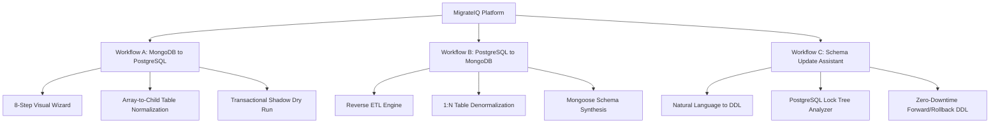

# MigrateIQ — Master Project Bible & Comprehensive Context Document for ChatGPT

> **How to use this document:** Copy and paste this entire document into ChatGPT (or any LLM) as a system prompt or context primer. It provides an exhaustive, production-grade architectural and implementation breakdown of **MigrateIQ**, covering its motivation, 3 core workflows, 18 development phases, 22 database migration challenges, strict engineering standards, and exact current codebase status.

---

## 1. Executive Overview & Product Identity

### 1.1 What is MigrateIQ?
**MigrateIQ** is an enterprise-grade, AI-assisted, bi-directional database migration and schema evolution desktop application built for Windows, macOS, and Linux. It specializes in cross-paradigm database transformations:
- **NoSQL (Document-Oriented / Flexible Schema):** MongoDB (BSON)
- **Relational (ACID / Strict 3NF / Relational Algebra):** PostgreSQL (SQL)

MigrateIQ bridges the architectural divide between document stores and relational databases. Rather than performing naive string transformations or dumping JSON into unstructured text columns, MigrateIQ executes deep schema introspection, automated structural normalization, type inference, constraint generation, pre-flight hazard risk analysis, and transactional shadow dry runs—all supervised by an interactive visual wizard powered by Google Gemini 1.5 Flash and a deterministic local rule engine.

### 1.2 The Problem MigrateIQ Solves
Modern engineering teams frequently need to migrate between MongoDB and PostgreSQL:
1. **Document to Relational (Scaling Integrity):** Startups start on MongoDB for rapid prototyping. As they scale to financial transactions, multi-table joins, and compliance audits, they face data inconsistency, lack of foreign keys, and application-level join latency. Migrating to PostgreSQL manually takes weeks of custom Python/Node scripts, risk of data loss, foreign key circular deadlock, and unpredictable downtime.
2. **Relational to Document (Read Scaling / Event Hubs):** Analytical workloads, real-time catalogs, or microservices moving to document models need denormalization (converting parent-child SQL tables into nested BSON subdocuments and arrays).
3. **Existing Tool Failures:**
   - **AWS Database Migration Service (DMS):** Expensive, requires AWS lock-in, lacks visual schema mapping, treats MongoDB as flat tables, and requires manual foreign key rebuilding.
   - **pgloader:** Relational-focused, command-line only, crashes on BSON arrays of objects, cannot perform AI-assisted relational normalization, and offers zero pre-migration risk analysis.
   - **Custom Scripts:** Prone to Node.js V8 memory overflow ($1.4\text{ GB}$ heap ceiling), unhandled null-byte (`\0`) poison pills, unhandled BSON types (`Decimal128`, `Long`), and lack of audit dossiers.

### 1.3 Core Value Proposition
- **100% Visual & Interactive:** 8-step wizard guiding the engineer from connection to live cutover.
- **Dual AI + Deterministic Rule Engine:** Uses Google Gemini 1.5 Flash for semantic column naming and relationship discovery, backed by a 100% offline rule engine for air-gapped security.
- **Zero Data Loss Guarantee:** Pre-migration risk reporting (30 hazard matrix), savepoint error isolation, and guaranteed transactional dry-run simulation (`BEGIN ... ROLLBACK`).
- **Complete Refactoring Package:** On completion, generates Mermaid Entity-Relationship Diagrams (ERD), automated rollback SQL scripts, Mongoose/Prisma ORM schema models, and auditor-ready PDF/Markdown dossiers.

---

## 2. The 3 Core Workflows

MigrateIQ is designed around three distinct engineering workflows:



### 2.1 Workflow A: MongoDB $\to$ PostgreSQL (Primary Migration Wizard)
An 8-step sequential pipeline:
1. **Step 1 — Direction & Mode Selection:** Choose MongoDB $\to$ PostgreSQL, select Full Migration or Partial Range, or activate Offline In-Memory Demo Mode.
2. **Step 2 — Source Connection:** Connect to MongoDB via URI or host/port parameters, with SRV record resolution, connection pooling, and collection sampling.
3. **Step 3 — Target Connection:** Connect to PostgreSQL, verify permissions (`CREATE TABLE`, `INSERT`), check schema search path (`public`), and test latency.
4. **Step 4 — AI-Assisted Schema Mapper:** Visual canvas showing MongoDB collections mapping to PostgreSQL tables. Maps fields, detects BSON types, unwinds arrays of objects into child tables with auto-added `sort_order INTEGER NOT NULL`, configures composite indexes, and provides a natural-language AI copilot for ad-hoc schema modifications.
5. **Step 5 — Pre-Migration Risk Analysis Report:** Scans schemas against 12 automated risk rules (30-hazard matrix). Evaluates circular foreign keys via Tarjan's DFS cycle detection, checks for missing NOT NULL constraints, flags Layer 2 objects (SQL views, stored triggers), and provides 1-Click Auto-Fix actions.
6. **Step 6 — Transactional Dry Run Simulation:** Executes a shadow migration inside an isolated PostgreSQL transaction with strict session timeouts (`lock_timeout = 5s`). Tests 500 sample documents per collection with PostgreSQL `SAVEPOINT` error isolation, calculates throughput ($rows/sec$) and ETA, and terminates with an unconditional `ROLLBACK` (0 permanent changes).
7. **Step 7 — Live Streaming Migration:** The core ETL engine. Executes topological sort (Kahn's DAG algorithm) to determine table creation and insertion order, streams documents in 500-row chunks using backpressure-managed cursor streams, routes failing rows to an isolated Dead-Letter Queue (`_migration_dlq`), and streams real-time progress bars and throughput charts over Electron IPC.
8. **Step 8 — Completion, Downloads & Refactoring Bundle:** Generates interactive Mermaid ERD diagram, downloads migration summary report, exports automated rollback script (`rollback_[timestamp].sql`), and generates modernized backend models (Prisma schema, TypeORM entities, and SQL DDL).

### 2.2 Workflow B: PostgreSQL $\to$ MongoDB (Reverse Migration)
Migrates relational tables into document collections:
- Introspects PostgreSQL foreign keys and 1:N / N:M relationships.
- Prompts the user with relational denormalization recommendations (e.g., embed `order_items` inside `orders` documents).
- Enforces MongoDB BSON document size boundary safeguards ($< 16\text{ MB}$).
- Synthesizes Mongoose schemas and MongoDB `$jsonSchema` validation scripts.

### 2.3 Workflow C: Schema Update Assistant (Natural Language Schema Evolution)
A standalone 6-step tool for continuous post-migration maintenance:
- User describes a schema change in plain English: *"Add an email_verified boolean column to users that defaults to false, and index it concurrently without locking the table."*
- Engine translates request into safe PostgreSQL DDL.
- **Lock Hazard Analysis:** Warns if an `ALTER TABLE` will acquire an `ACCESS EXCLUSIVE` table lock that blocks read/write queries on high-traffic production databases.
- Generates **Forward Migration DDL** (`V2__add_email_verified.sql`) and **Zero-Downtime Rollback DDL** (`U2__rollback_email_verified.sql`).

---

## 3. The Dual-Document Protocol & 18-Phase Roadmap

### 3.1 The Dual-Document Protocol (`AGENTS.md`)
In MigrateIQ, every phase is specified by **two complementary documents** that describe the same features from two perspectives:
1. `phase_plan-v2.md` — **Technical & Structural Specification:** Defines architecture, IPC channels, algorithms, database queries, and unit test criteria ("How it is built").
2. `product_blueprint-v7.md` — **User-Facing & Experiential Specification:** Defines exact UI screens, design tokens, copy text, button states, modal layouts, and user interactions ("What the user sees").

### 3.2 The Complete 18-Phase Roadmap

| Phase | Milestone Title | Primary Scope | Status |
| :--- | :--- | :--- | :--- |
| **Phase 0** | **Monorepo Foundation** | Turborepo / npm workspaces, TypeScript base, `@migrateiq/shared` types | ✅ **Completed** |
| **Phase 1** | **Landing Website** | Next.js 14 App Router, 5 marketing pages, Inter font, Vanilla CSS | ✅ **Completed** |
| **Phase 2** | **Desktop App Shell** | Electron 28+, React 18, Vite, Sidebar navigation, HashRouter, AppShell | ✅ **Completed** |
| **Phase 3** | **Home Dashboard** | Resume active migration banner, workflow entry cards, recent history | ✅ **Completed** |
| **Phase 4** | **Database Connectivity** | MongoDB & PostgreSQL connection forms, SSL, latency, schema sampling | ✅ **Completed** |
| **Phase 5** | **AI Schema Mapping** | AI Schema Mapper canvas, BSON type matrix, Rule Engine, Copilot | ✅ **Completed** |
| **Phase 6** | **AI Rule Refinement** | Gemini prompt optimization, token guardrails, JSON Schema export | ✅ **Completed** |
| **Phase 7** | **Risk Analysis Report** | 12 risk rules, 30-hazard matrix, DFS cycle detection, 1-Click Auto-Fix | ✅ **Completed** |
| **Phase 8** | **Dry Run Simulation** | Transactional shadow run (`ROLLBACK`), 16 safeguards, telemetry bar | ✅ **Completed** |
| **Phase 9** | **Live Migration Engine** | Topological sort DAG, cursor streaming, backpressure, batch savepoints | ⏳ **Next Up** |
| **Phase 10** | **Completion & Downloads** | Interactive Mermaid ERD, PDF/Markdown audit reports, ORM models | ⏳ Pending |
| **Phase 11** | **Schema Update Assistant**| Workflow C: NL2DDL, lock tree analysis, forward/rollback scripts | ⏳ Pending |
| **Phase 12** | **PG to Mongo Workflow** | Workflow B: Introspection, 1:N denormalization, Mongoose export | ⏳ Pending |
| **Phase 13** | **In-Memory Demo Mode** | Zero-network bundled e-commerce testbed with simulated ETL | ⏳ Pending |
| **Phase 14** | **Auxiliary Screens** | History screen, Schema Version History, Saved Connections, Settings | ⏳ Pending |
| **Phase 15** | **Partial Migration** | Granular collection filter, timestamp range slicer, CDC preparation | ⏳ Pending |
| **Phase 16** | **Testbed Applications** | ShopBridge e-commerce testbed with intentional messy seed data | ⏳ Pending |
| **Phase 17** | **Final Polish & Build** | Electron-builder Windows `.exe` installer, performance hardening | ⏳ Pending |

---

## 4. Deep Dive into Completed Phases (Phases 0 through 8)

### Phase 0: Monorepo Foundation & Shared Types
- Built an npm workspace monorepo containing:
  - `apps/desktop`: Electron 28+ desktop application.
  - `apps/web`: Next.js 14 marketing portal.
  - `packages/shared`: Shared TypeScript interfaces and utility types.
- Established strict TypeScript configuration (`noImplicitAny: true`, strict null checks, zero `any`).

### Phase 1: Landing Marketing Website (`apps/web`)
- 5 comprehensive pages using Next.js 14 App Router:
  - Home (`/`): Hero with interactive terminal preview, workflow switcher, feature matrix, and pricing.
  - Features (`/features`): Deep dive into AI Schema Mapping, Risk Analysis, and Streaming ETL.
  - How It Works (`/how-it-works`): 8-step interactive visual walkthrough.
  - Download (`/download`): Platform installer links (Windows `.exe`, macOS `.dmg`, Linux `.AppImage`).
  - About (`/about`): Academic motivation, team, and open-source vision.
- Custom light-theme design system using Vanilla CSS (zero Tailwind).

### Phase 2: Desktop App Foundation & Shell (`apps/desktop`)
- Electron main process (`main/main.ts`) with Chromium renderer (`renderer/src/`).
- Secure IPC architecture: `contextIsolation: true`, `nodeIntegration: false`, `sandbox: false`.
- Preload script (`main/preload.ts`) exposing typed `window.electronAPI` over `contextBridge`.
- Global App Shell with sidebar navigation, active route indicator, window chrome controls, and status pills.

### Phase 3: Home Dashboard (`apps/desktop/renderer/src/screens/HomeDashboard.tsx`)
- Active migration resume banner reading persisted session state from `electron-store`.
- Quick action cards for **Workflow A** (MongoDB $\to$ PostgreSQL), **Workflow B** (PostgreSQL $\to$ MongoDB), **Workflow C** (Schema Update Assistant), and **Offline Demo Mode**.
- Recent migration runs table with status badges (Completed, In Progress, Failed) and execution durations.

### Phase 4: Database Connectivity (`apps/desktop/main/handlers/db.ts`)
- MongoDB native driver (`MongoClient`) and PostgreSQL driver (`pg.Client` & `pg.Pool`).
- Validates connection strings, username/passwords, SSL certificates, and custom ports.
- Password masking (`maskSensitiveFields`) replacing passwords with `••••••••` across all IPC logs and stores.
- Introspects source collections, estimates document counts, infers sample fields, and measures ping latency.
- Validates PostgreSQL user permissions (`hasCreatePrivilege`, `hasInsertPrivilege`).

### Phase 5 & 6: AI Schema Mapping & Copilot (`apps/desktop/main/handlers/ai.ts`)
- **Bidirectional BSON $\leftrightarrow$ PostgreSQL Type Translation:**
  - `ObjectId` $\leftrightarrow$ `VARCHAR(24)` / `UUID`
  - `string` $\leftrightarrow$ `VARCHAR(255)` / `TEXT`
  - `int` / `long` $\leftrightarrow$ `INTEGER` / `BIGINT`
  - `double` / `decimal` $\leftrightarrow$ `NUMERIC(10,2)` / `DOUBLE PRECISION`
  - `bool` $\leftrightarrow$ `BOOLEAN`
  - `date` $\leftrightarrow$ `TIMESTAMPTZ` / `DATE`
  - `binData` $\leftrightarrow$ `BYTEA`
  - `arrayOfObjects` $\leftrightarrow$ Relational Child Table (Rule 4: auto-added `sort_order INTEGER NOT NULL`)
  - `array` (scalars) $\leftrightarrow$ `TEXT[]` / `INTEGER[]`
  - `object` (heterogeneous) $\leftrightarrow$ `JSONB`
- **Dual AI Engine Architecture:**
  - Online Mode: Calls Google Gemini 1.5 Flash (`@google/generative-ai`) with structured JSON schema responses.
  - Offline / Air-Gapped Mode: Deterministic local rule engine (`main/engine/ruleEngine.ts`) executing statistical presence ratios and type inference.
- **Copilot Natural Language Refinement:** Users can type prompt commands: *"Change order_total to NUMERIC(12,2) and make user_id required"*. The copilot applies surgical JSON schema mutations.
- **Token Quota Monitor (`AIUsageScreen.tsx`):** Tracks input/output tokens, estimated cost, and free-tier rate limits.

### Phase 7: Pre-Migration Risk Analysis Engine (`apps/desktop/main/engine/riskAnalyzer.ts`)
- Scans mapped schemas against **12 Automated Risk Rules (30-Hazard Matrix)**:
  1. `NOT_NULL_WITHOUT_DEFAULT`: Identifies non-nullable target columns mapped to source fields with $<100\%$ presence ratio or null values.
  2. `CIRCULAR_DEPENDENCY`: Detects circular foreign key references using Tarjan's DFS Cycle Detection algorithm.
  3. `ARRAY_OF_OBJECTS_RELATIONAL_IMPACT`: Warns on large arrays split into child tables.
  4. `INDEX_PERFORMANCE_HAZARD`: Flags non-concurrent index creation on high-volume tables.
  5. `POLYMORPHIC_FIELD_TYPE`: Detects source fields storing multiple data types (e.g., string in some docs, int in others).
  6. `MISSING_PRIMARY_KEY`: Warns if no primary key is designated for a target table.
  7. `UNMAPPED_COLLECTION`: Warns if source collections are excluded from migration.
  8. `MEMORY_OVERFLOW_RISK`: Flags collections with $>100,000$ documents requiring batch chunking.
  9. `LAYER2_STORED_PROCEDURES`: Identifies source stored logic requiring manual rewrite.
  10. `LAYER2_TRIGGERS`: Identifies database triggers requiring reimplementation.
  11. `LAYER2_VIEWS`: Detects SQL views requiring target recreation.
  12. `LARGE_OBJECT_BSON_BOUND`: Flags documents approaching the 16MB BSON boundary.
- **1-Click Auto-Fix Actions:** Users can click to automatically set nullable, apply default values, create child tables, reduce batch size, or defer foreign keys.

### Phase 8: Transactional Dry Run Simulation (`apps/desktop/main/engine/dryRun.ts`)
- **16 Enterprise Safeguards:**
  1. *Transaction Isolation & Guaranteed Rollback:* Opens `BEGIN;`, executes DDL, inserts 500-row sample batches, and guarantees `ROLLBACK;`. Target DB is 100% untouched.
  2. *Session Safety Timeouts:* Sets `lock_timeout = '5s'`, `statement_timeout = '15s'`, and `idle_in_transaction_session_timeout = '10s'` to prevent production locks.
  3. *Deferred Constraint Checks:* `SET CONSTRAINTS ALL DEFERRED;` prevents foreign key ordering failures during shadow testing.
  4. *Null-Byte Poison Pill Stripping:* Strips binary `\0` characters from strings and JSONB before PostgreSQL ingestion.
  5. *63-Byte Identifier Truncation & Hash Collision Defense:* Capped at 58 chars with a 4-char hex hash suffix to prevent duplicate column errors.
  6. *Universal Type Coercion:* Handles numeric Unix epoch timestamps (`1726740000000`), pure `TIME` (`'14:30:00'`), pure `DATE` (`YYYY-MM-DD`), UUID formats (36-char, 32-char hex, 16-byte Buffer), and BSON types (`Decimal128`, `Long`, `Binary`, `Timestamp`, `Int32`, `Double`).
  7. *Child Table `sort_order`:* Injects `sort_order INTEGER NOT NULL` into child tables (Rule 4 & Challenge 9).
  8. *SQL Keyword Preservation in DDL:* Formats defaults without surrounding quotes for SQL functions (`DEFAULT CURRENT_TIMESTAMP`, `DEFAULT NOW()`, `DEFAULT TRUE`, numbers) via `formatSqlDefaultClause()`.
  9. *6-Tier Cascading Error Column Detection:* Wire protocol `pgErr.column` $\to$ constraint detail `Key (...)` $\to$ regex $\to$ value cross-referencing in `row.values` $\to$ length measurement $\to$ table column fallback. `detectedField` is never `undefined`.
  10. *Real-Time Throughput Profiling ($rows/sec$):* Measures wire ingestion speed.
  11. *Full Migration ETA Calculator:* Real-time extrapolation formula ($T = N / Speed$).
  12. *Storage Headroom Analysis:* Queries `SELECT pg_database_size(current_database())` and compares projected migration footprint against available disk headroom.
  13. *Surrogate Key Preservation:* Prevents sequence burning (`SERIAL`/`IDENTITY`) during rollback testing.
  14. *Credential Masking:* Enforces `maskSensitiveFields()` across all traces.
  15. *Single-Table Isolated Re-simulation (`🔄 Re-test`):* Sub-200ms isolated test for single tables.
  16. *Pre-Flight Audit Dossier (`📥 Export Dossier`):* Downloads a compliance verification report.
- **3-Tier Industrial Resolution Architecture:**
  - **Option A (🌟 RECOMMENDED — Smart Default Imputation):** Imputes missing values with type-aware defaults, keeps `NOT NULL`, migrates 100% of records, and passes row-count reconciliation without crashing downstream services.
  - **Option B (⚠️ CAUTION — Relax to NULLABLE):** Relaxes target column to `NULLABLE` with explicit warnings about downstream application `NullPointerException` crash risks.
  - **Option C (⚠️ WARNING — Strict Quarantine / DLQ):** Retains `NOT NULL` without fallbacks, routing invalid rows to the Dead-Letter Queue with row-count discrepancy warnings.

---

## 5. Technical Stack & UI/UX Design System

### 5.1 Technology Stack

```
┌─────────────────────────────────────────────────────────────┐
│                      MigrateIQ Monorepo                     │
├──────────────────────────────┬──────────────────────────────┤
│ Desktop App (apps/desktop)   │ Web Portal (apps/web)        │
│ • Electron 28+               │ • Next.js 14 (App Router)    │
│ • React 18 + Vite            │ • React 18 (Server Comps)    │
│ • Vanilla CSS (Design Tokens)│ • Vanilla CSS Modules        │
│ • Zustand (Reactive State)   │ • Static Export Support      │
│ • electron-store (Disk Store)│                              │
├──────────────────────────────┴──────────────────────────────┤
│ Shared Package (packages/shared)                            │
│ • Shared TypeScript Contracts, Enums, Interfaces, Constants │
├─────────────────────────────────────────────────────────────┤
│ Core Engines & Drivers (Node.js in Electron Main Process)   │
│ • mongodb (Native Node.js Driver v6)                        │
│ • pg (Node-Postgres Driver v8 with Connection Pooling)       │
│ • @google/generative-ai (Gemini 1.5 Flash SDK)              │
│ • Zod (Schema Validation & Structured LLM Parsing)          │
└─────────────────────────────────────────────────────────────┘
```

### 5.2 Strict UI/UX & Design Guidelines (`AGENTS.md`)
- **Mode:** Strictly **LIGHT THEME** — crisp, bright, white-and-blue professional interface. Never use dark backgrounds, dark sidebars, or dark cards.
- **Color Palette & Tokens:**
  - Canvas Background: `#F8FAFC` (Slate-50 — very light soft gray)
  - Card / Surface Background: `#FFFFFF` (Pure White)
  - Sidebar & Header Surface: `#F1F5F9` (Slate-100 — light silver-gray)
  - Borders & Dividers: `#E2E8F0` (Slate-200 — crisp 1px borders)
  - Primary Headings & Text: `#0F172A` / `#1E293B` (Deep Navy Slate)
  - Muted Text & Labels: `#64748B` (Slate-500)
  - Primary Brand / Action: `#2563EB` (Royal Tech Blue — hover `#1D4ED8`)
  - AI & Secondary Accent: `#0284C7` (Sky Blue — AI badges, health score)
  - Status Colors: Success `#16A34A` (Green), Warning `#D97706` (Amber), Critical `#DC2626` (Crimson)
- **Typography:** **Inter** font family imported from Google Fonts.
- **Styling Rule:** Vanilla CSS only. No Tailwind CSS in the desktop app.
- **Micro-Interactions:** Subtle card hover lifts (`translateY(-2px)`), 200ms ease transitions, pulse skeletons for loading states (never raw spinners).

### 5.3 Engineering Standards & Code Hygiene
- **Zero Any Rule:** Strictly TypeScript. Never use `any`, `@ts-ignore`, or `@ts-nocheck`.
- **IPC Protocol:** All handlers use `ipcMain.handle` and return typed objects:
  ```typescript
  interface IPCResponse<T> {
    success: boolean;
    data?: T;
    error?: string;
  }
  ```
- **SQL Safety:** All data queries use parameterized values (`$1, $2`). All identifiers are sanitized with `sanitizeIdentifier()` (lowercase, alphanumeric + underscores, truncated to 63 bytes with collision hash).
- **Password Masking:** All logs and persistence layers invoke `maskSensitiveFields()`.

---

## 6. The 22 Enterprise Migration Challenges & Engineering Solutions

MigrateIQ solves 22 core technical challenges outlined in the Product Blueprint:

### Data Structure Challenges
1. **Embedded Arrays of Objects $\to$ Child Tables:** MongoDB stores order items inside the order document. MigrateIQ unwinds arrays of objects into relational child tables (e.g. `order_items`), injecting a foreign key to the parent and an auto-generated `sort_order INTEGER NOT NULL` column to preserve original array sequence (Rule 4 & Challenge 9).
2. **Polymorphic / Mixed Field Types:** MongoDB allows a field (e.g. `phoneNumber`) to be a string in some documents and an integer in others. The engine detects polymorphism during sampling, flags it in the Risk Report, and converts to a unified SQL type (`VARCHAR` or `JSONB`).
3. **Dirty & Missing Data:** Source fields missing in 20% of documents trigger NOT NULL constraint violations. MigrateIQ provides Option A (Type-aware smart default imputation) and Option B (Schema relaxation to NULLABLE).
4. **Primary Key Mismatch:** MongoDB `_id` (24-char hex `ObjectId`) versus PostgreSQL integer `SERIAL` or `UUID`. MigrateIQ supports both `VARCHAR(24)` direct mapping and two-tier ID translation tables.
5. **Deeply Nested Objects:** Complex subdocuments (e.g. `customer.address.geo.lat`) can either be flattened using dot-notation (`customer_address_geo_lat`) or preserved as relational `JSONB` columns with GIN indexes.

### Layer 2 Database Logic
6. **Stored Procedures:** NoSQL databases have no stored procedures, but PostgreSQL does (PL/pgSQL). The engine scans and inventories procedures.
7. **Database Triggers:** Detects and reports triggers on target tables that could fire during migration and degrade ETL ingestion speeds.
8. **SQL Views:** Introspects SQL views that depend on tables being migrated and flags dependency order.

### ETL & Engine Execution
9. **Topological Insertion Order:** Tables must be created and populated in foreign key dependency order (Parents before Children). MigrateIQ runs Kahn's Algorithm on a Directed Acyclic Graph (DAG).
10. **Circular Foreign Key Dependencies:** When Table A references Table B and Table B references Table A, topological sort fails. MigrateIQ flags the cycle using Tarjan's DFS algorithm and defers foreign key constraint validation (`SET CONSTRAINTS ALL DEFERRED;` or creates constraints after data loading via `ALTER TABLE ... ADD CONSTRAINT ... NOT VALID`).
11. **Node.js V8 Memory Overhead ($1.4\text{ GB}$ Ceiling):** Large datasets of millions of records cannot be loaded into Node.js heap memory. MigrateIQ uses stream backpressure and 500-row batch chunking with garbage collector breathing room.
12. **High-Speed Migration:** Uses PostgreSQL multi-row parameterized `INSERT INTO ... VALUES (...), (...)` and batch chunking to sustain 2,500+ rows/sec.
13. **Partial Migration & Range Filtering:** Allows engineers to filter by date range or specific collections for phased cutovers.

### Schema Evolution & DDL Safety
14. **Table Locking During `ALTER TABLE`:** Adding columns or constraints in PostgreSQL can acquire `ACCESS EXCLUSIVE` locks that block all application traffic. MigrateIQ analyzes lock trees and generates non-blocking DDL (`NOT VALID` followed by `VALIDATE CONSTRAINT`).
15. **Index Creation Blocking:** Creating an index on a live table blocks concurrent writes. MigrateIQ automatically generates `CREATE INDEX CONCURRENTLY`.
16. **Adding NOT NULL to Large Existing Tables:** Adding `NOT NULL` scans the entire table under a lock. MigrateIQ generates check constraints (`ADD CONSTRAINT CHECK (...) NOT VALID`) to avoid locking.
17. **Precision Loss in Floating Point Numbers:** Prevents JavaScript `Number` IEEE-754 precision loss by treating BSON `Decimal128` and SQL `NUMERIC` as strings.
18. **Rollback Preparedness:** Pre-generates full rollback SQL scripts (`DROP TABLE ... CASCADE`) before any live rows are written.

### Cloud Connectivity & Usability
19. **Cloud Connection Poolers (PgBouncer):** Detects transaction-mode poolers (like Supabase or AWS RDS Proxy) and avoids session-level prepared statement crashes.
20. **DNS SRV Record Resolution:** Handles `mongodb+srv://` connection strings with automatic timeout handling and fallback to standard TCP.
21. **Schema Versioning & Changelog:** Logs all executed schema migrations with forward/backward diff tracking in `electron-store`.
22. **Zero-Database Offline Demo Mode:** Allows users to test the entire application workflow without live databases using bundled, synthesized e-commerce data.

---

## 7. Codebase Map & Key File Directory

```
c:\Users\SIDDHESH\Desktop\Int_DB_Migration\
├── apps\
│   ├── desktop\                                # Electron 28+ Desktop Application
│   │   ├── main\                               # Node.js Main Process
│   │   │   ├── main.ts                         # Electron bootstrap, window creation, IPC registration
│   │   │   ├── preload.ts                      # Secure contextBridge exposing electronAPI
│   │   │   ├── engine\                         # Core ETL & Analysis Engines
│   │   │   │   ├── dryRun.ts                   # Transactional dry-run simulation engine (Phase 8)
│   │   │   │   ├── riskAnalyzer.ts             # 12-rule pre-migration risk analyzer (Phase 7)
│   │   │   │   ├── layer2Analyzer.ts           # Triggers, views, and stored proc inspector (Phase 7)
│   │   │   │   └── ruleEngine.ts               # Local deterministic schema mapping engine (Phase 5)
│   │   │   └── handlers\                       # Electron IPC Handlers
│   │   │       ├── db.ts                       # Database connections & schema introspection (Phase 4)
│   │   │       ├── ai.ts                       # Gemini AI schema mapping & copilot (Phase 5)
│   │   │       ├── aiUsageStore.ts             # Token tracking & quota persistence (Phase 5)
│   │   │       ├── risk.ts                     # Risk analysis IPC & credential masking (Phase 7)
│   │   │       ├── dryRun.ts                   # Dry run IPC & progress streamer (Phase 8)
│   │   │       └── store.ts                    # electron-store configuration handler
│   │   └── renderer\src\                       # Chromium React 18 + Vite Frontend
│   │       ├── App.tsx                         # AppShell, global sidebar & route dispatcher
│   │       ├── components\                     # Reusable UI components
│   │       │   ├── ConnectionForm.tsx          # Database connection test component
│   │       │   ├── SchemaVisualizer.tsx        # Canvas representation of collections
│   │       │   └── ...
│   │       ├── screens\                        # Wizard & Application Screens
│   │       │   ├── HomeDashboard.tsx           # Step 0 Dashboard & resume banner (Phase 3)
│   │       │   ├── MigrationWizard.tsx         # Master 8-step wizard controller
│   │       │   ├── SchemaMapper.tsx            # Step 4 AI Schema Mapper & Copilot (Phase 5)
│   │       │   ├── RiskReport.tsx              # Step 5 Risk Analysis Report (Phase 7)
│   │       │   ├── DryRunScreen.tsx            # Step 6 Transactional Dry Run (Phase 8)
│   │       │   ├── AIUsageScreen.tsx           # Token consumption & cost monitor
│   │       │   └── ... (Placeholder screens: Connections, History, Settings, SchemaUpdate)
│   │       ├── store\
│   │       │   └── wizardStore.ts              # Central Zustand reactive store
│   │       └── styles\                         # Vanilla CSS light-theme stylesheets
│   │           ├── dry-run.css                 # Step 6 Dry run styles & telemetry bar
│   │           ├── risk-report.css             # Step 5 Risk report styles & cards
│   │           └── ...
│   └── web\                                    # Next.js 14 Marketing Portal (Phase 1)
│       ├── app\                                # App Router pages (/, /features, /how-it-works, etc.)
│       └── components\                         # Navbar, Footer, Hero, TerminalPreview
├── packages\
│   └── shared\                                 # Shared Monorepo Package
│       └── src\
│           └── types.ts                        # Shared TypeScript interfaces & types
├── documentation\                              # Verified Phase Documentation
│   ├── README.md                               # Index of all phases
│   ├── phase-00-monorepo-foundation.md         # Phase 0 doc
│   ├── phase-01-landing-website.md             # Phase 1 doc
│   ├── phase-02-desktop-app-shell.md           # Phase 2 doc
│   ├── phase-03-home-dashboard.md              # Phase 3 doc
│   ├── phase-04-database-connectivity.md       # Phase 4 doc
│   ├── phase-05-ai-schema-mapping.md           # Phase 5 doc
│   ├── phase-07-risk-report.md                 # Phase 7 doc
│   └── phase-08-dry-run-simulation.md          # Phase 8 doc
├── scripts\                                    # Verification & Seeder Scripts
│   ├── seed-phase8-testbed.js                  # Exhaustive testbed seeder for Mongo & Postgres
│   └── test-phase8-dry-run.js                  # Automated Phase 8 verification suite (57 tests)
├── phase_plan-v2.md                            # Technical specification source of truth
├── product_blueprint-v7.md                     # User-facing UX/UI source of truth
└── AGENTS.md                                   # Strict AI Pair Programming Directives
```

---

## 8. Academic & Research Foundations

MigrateIQ's architecture is grounded in 10 computer science peer-reviewed papers located in the `research/` directory:
1. **Baazizi et al. (VLDB 2019):** Minimal common schema inference, structural unions, and presence ratio formulas used in Phase 5 schema introspection.
2. **Belefqih et al. (2023/2024):** Systematic review of 50+ NoSQL schema extraction methods and stratified sampling algorithms used in Phase 4.
3. **Klettke, Störl, & Scherzinger (2015):** Schema drift detection, structural outliers, and dirty field identification used in Phase 7 Risk Engine.
4. **Frozza et al. (2018):** Extended JSON/BSON type inference and precision preservation algorithms used in `transformValueForSql`.
5. **Karnitis & Arnicans (2015):** Rel2Doc and Doc2Rel formal models for relational normalization versus hybrid JSONB denormalization.
6. **Li et al. (DITTO, VLDB 2021):** Deep learning for semantic schema matching and foreign key inference.
7. **Trummer (VLDB 2022/2023):** Benchmarks for Large Language Models generating correct database DDL (NL2DDL).
8. **Kahn's Algorithm (1962):** Topological sorting of Directed Acyclic Graphs (DAG) for foreign key dependency sequencing in Phase 9.
9. **Tarjan's Strongly Connected Components Algorithm (1972):** DFS cycle detection for circular foreign key isolation in Phase 7.
10. **Stripe Zero-Downtime Migration Patterns:** Multi-phase dual-writing, backward-compatible constraints, and shadow testing.

---

## 9. Next Steps: Phase 9 (Live Migration Streaming Engine)

Phase 9 is the next milestone to be implemented:

### Technical Scope for Phase 9 (`phase_plan-v2.md` lines 612–655):
1. **Topological Sort Execution:** Orders table creation and data insertion based on parent-child foreign key hierarchy (`users` $\to$ `orders` $\to$ `order_items`).
2. **Rollback SQL Pre-generation:** Generates `DROP TABLE ... CASCADE` statements and saves them to disk before any live insert occurs.
3. **Streaming Cursor ETL:** Streams MongoDB collections in 500-row chunks using Node.js stream backpressure to maintain a flat memory profile ($< 150\text{ MB}$ RAM).
4. **Batch Insertion with Savepoints:** Executes parameterized batch `INSERT` statements into PostgreSQL. If a batch fails, rolls back to savepoint and isolates the single faulty row.
5. **Dead-Letter Queue (DLQ):** Routes failed rows to `_migration_dlq` table with full error context.
6. **Live Telemetry Streaming:** Emits IPC events every 500ms reporting overall percentage, throughput ($rows/sec$), and recalculated ETA.

---

## 10. Directives for ChatGPT When Helping with MigrateIQ

When writing code or assisting with MigrateIQ, ChatGPT **must strictly follow these rules**:
1. **Strict Light Theme Only:** Never generate dark backgrounds (`#0F172A`), dark cards, or dark sidebars. Always use `#F8FAFC` (canvas), `#FFFFFF` (cards), `#F1F5F9` (surfaces), `#E2E8F0` (borders), and `#2563EB` (blue accents).
2. **Consult Dual Documents First:** When starting a phase, review both `phase_plan-v2.md` (technical) and `product_blueprint-v7.md` (UX/UI) to provide a unified specification.
3. **No Any Rule:** Write strictly typed TypeScript without using `any`, `@ts-ignore`, or `@ts-nocheck`.
4. **IPC Patterns:** All Electron IPC handlers must use `ipcMain.handle` and return `{ success: boolean, data?: T, error?: string }`.
5. **Array to Child Table Rule:** Whenever a MongoDB array of objects is mapped to a PostgreSQL child table, always add `sort_order INTEGER NOT NULL` with 0-based indexing (Rule 4 & Challenge 9).
6. **SQL Safety & Credential Masking:** Always use parameterized queries (`$1, $2`). Sanitize table and column names with `sanitizeIdentifier()`. Filter all logs through `maskSensitiveFields()`.
7. **Component Organization:** React components in PascalCase (e.g. `SchemaMapper.tsx`), utility engines in camelCase (e.g. `dryRun.ts`). Define a typed `Props` interface above every React component.
